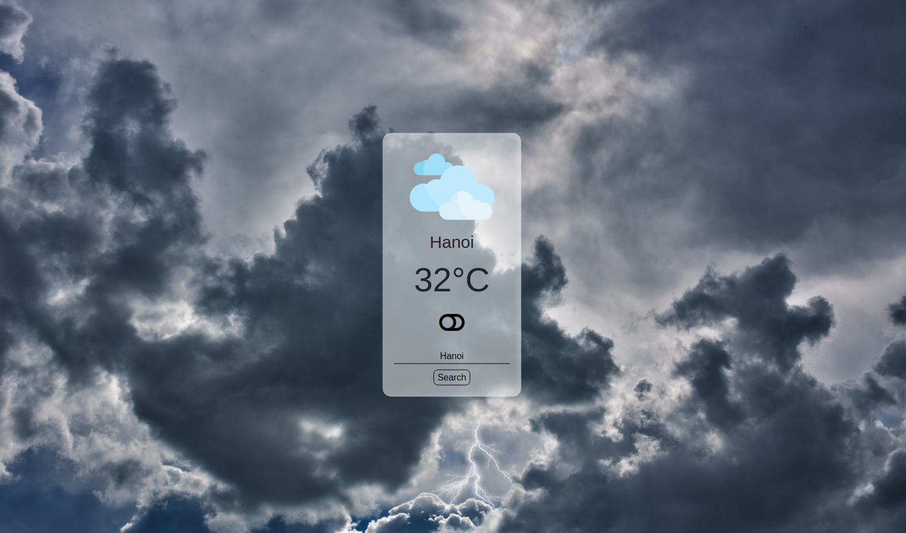

  <h1><b>Weather App</b></h1>

A simple desktop&tablet-app for checking the weather implemented through HTML5, CSS3, Javascript and the usage of the openweather-api. Users can look up the current temperature in their city of choice and switch between Celsius and Fahrenheit. An error message will pop up if the city is not found. The background and weather logo will change depending on the predominant weather.
   
  

## Live Version
https://elastic-bhabha-68ab06.netlify.app/

   

## Content

<a text-align="center" href="#about">About</a>&nbsp;&nbsp;&nbsp;|&nbsp;&nbsp;&nbsp;
<a href="#ins">Installations</a>&nbsp;&nbsp;&nbsp;|&nbsp;&nbsp;&nbsp;
<a href="#usage">Usage</a>&nbsp;&nbsp;&nbsp;|&nbsp;&nbsp;&nbsp;
<a href="#app">App</a>&nbsp;&nbsp;&nbsp;|&nbsp;&nbsp;&nbsp;
<a href="#with">Built With</a>&nbsp;&nbsp;&nbsp;|&nbsp;&nbsp;&nbsp;
<a href="#author">Author</a>

## About 
This project was a task by Microverse Inc. to build a weather app inluding the usage of an api.

## 🔧 Built with

  - [x] HTML5
  - [x] CSS3
  - [x] Vanilla Javascript
  - [x] Webpack

## Usage 
To use the code in this repository, follow the steps in this section:

### 🔨 Prerequisites
 You should have the following packages installed on your computer inorder to run the code contained herein.

- Node JS 
- npm and npx

### 🔨 Setup
First get a copy of the project on your computer:

- Clone or download the repository to a local directory on your computer by following the Github instructions at [Github clone/download repository](https://docs.github.com/en/enterprise/2.13/user/articles/cloning-a-repository).

### 🛠 Installing 
Once you have a local copy of the entire project on your computer,
If you don't meet the above prerequisites, then:

- Visit [node download and installations docs](https://docs.npmjs.com/downloading-and-installing-node-js-and-npm) to install node js and npm.

###  App 
With the installations above complete, you are set to use the code and view the application built in this repository. Follow these simple steps:

- Change directory into the directory where you cloned the repository. Forexample ``vanheaven@vanheaven-VirtualBox:~/Microverse-projects$ cd weather-app.``
- Open the index.html file using your browser

## ✒️  Authors 

👤 **Marco Erhardt**

- Github: [@marcode95](https://github.com/marcode95)
- Linkedin: [@linkedin](https://www.linkedin.com/in/marcoerhardt95/)

## 🤝 Contributing

Contributions, issues and feature requests are welcome!

To contribute to the code base, follow the steps below:
  1. Fork this repository to your remote respository by clicking the Fork button in this repository.
  2. Clone this repository to a directory on your computer by following Github guidelines.
  3. Change directory into the directory where you cloned this repository to.
  4. Open the directory using your favorite editor.
  5. Create a feature branch off the develop branch.
  5. Make and commit the nuanced code.
  6. Open a pull request describing the improvements made
And your reward awaits in heaven.

## 👍 Show your support

Give a ⭐️ if you like this project!

## :clap: Acknowledgements
- [API](https://openweathermap.org/)  
